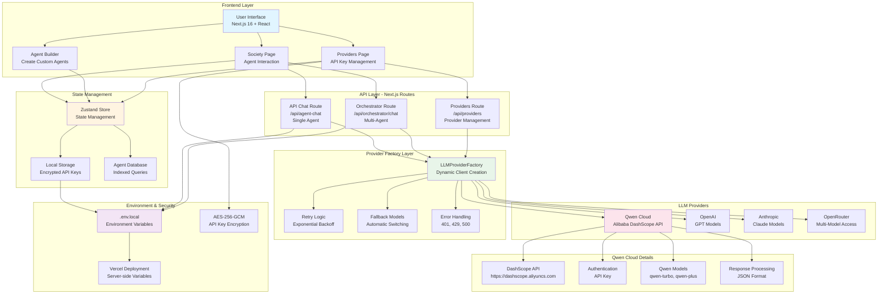
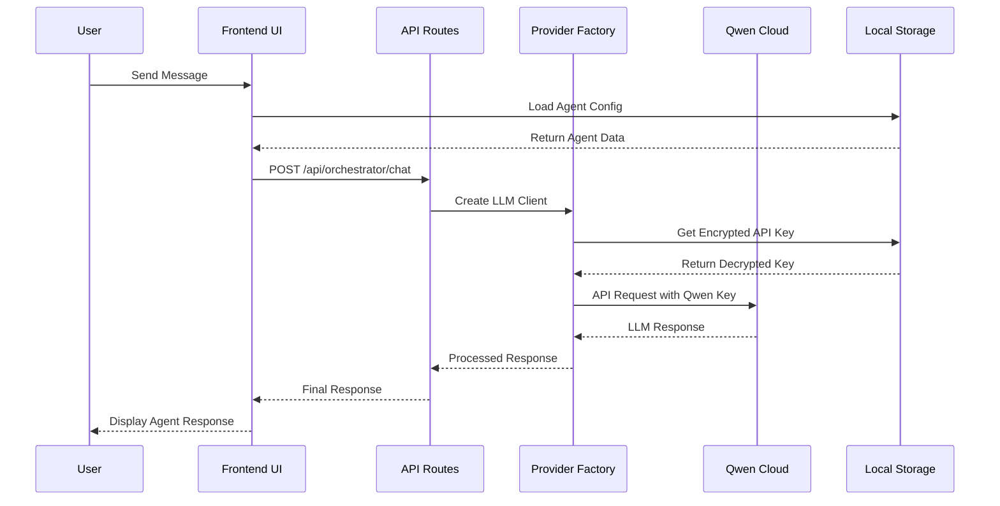
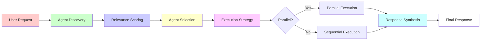
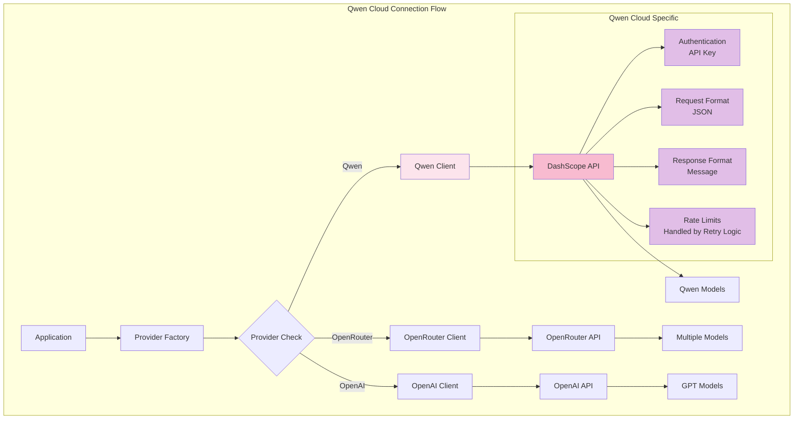
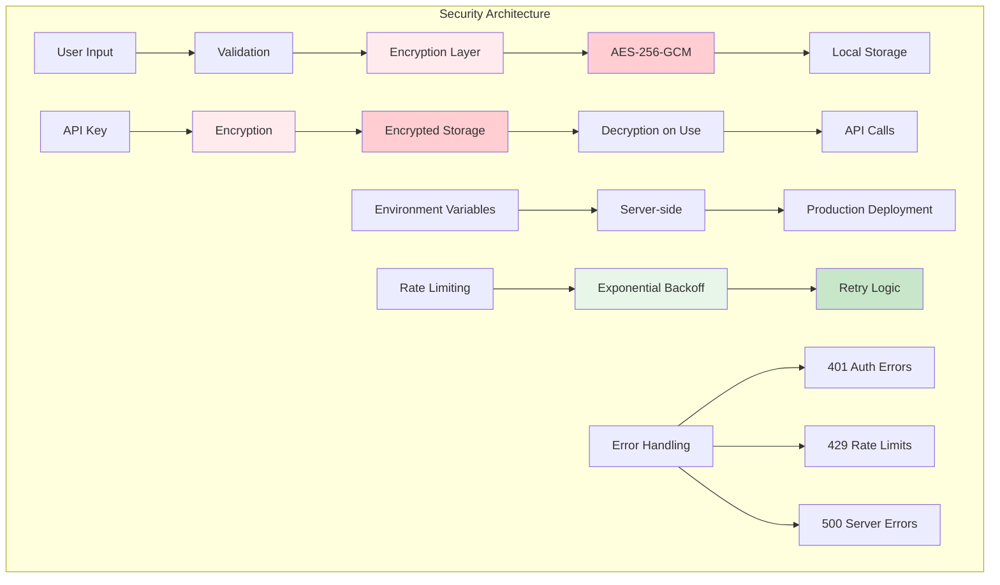

# Agent Society Architecture Diagram

## System Architecture with Qwen Cloud Integration

## Data Flow Diagram

## Component Interaction Diagram

## Qwen Cloud Integration Details

## Security Layer Diagram

